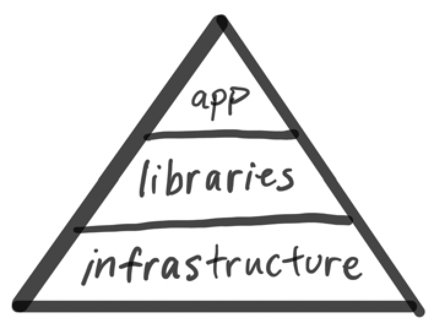
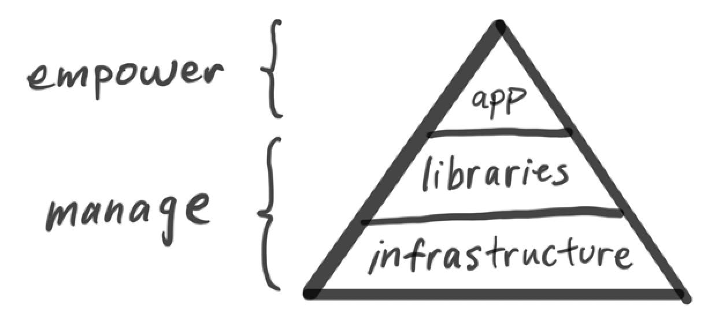

class: middle hide-slide-number

# <ins>Platform-Powered</ins>

Build a frontend platform that scales as fast as you do

#### Andrew Hao ([@andrewhao](https://www.twitter.com/andrewhao))

???

Hi everyone, I'm Andrew. I'm a software engineer at Lyft.

---

class: center middle

## Ever felt growing pains?

---

class: middle

## "...most tools and processes only support about one order of magnitude of growth before becoming ineffective"

##### Will Larson. _An Elegant Puzzle: Systems of Engineering Management_

---

## Generation 1: Monolith

- Python/Angular monolith
- Everything is in one codebase
- Conventions can be enforced
- Code is reviewed in one place

???

But problems

---

## Generation 2: Microservices

- Node + React isomorphic (SSR) apps via a templated service generator
- ...coupled with infrastructure investments in microservices
- ...led to a microservice explosion!

---

## But the problems were starting to catch up to us

- Long-lived services require maintenance
- Platform was fragmenting
- New infrastructure updates were hard to apply
- Increased service load

???

---

class: diagram-image middle center

### Technical leverage


???

This is a talk about leverage, and how to think about it and knowing where to apply it. When building a system that scales, you have to find the right points in the system where you can exert technical leverage

---

class: middle

#### Technical Leverage: Applying Outsized Force

- Developer productivity
- System reliability
- Security

---

class: middle center

## But where to start?

???

But where in the system do you apply?

It can be hard to know where to start. It’s worse to build the wrong abstraction than have no abstraction at all.

We selectively apply leverage at different tiers of the system

---

class: diagram-image middle center



---

class: diagram-image middle center



???

At the top app layer: empower (allow developers to do anything they want)
At the bottom library/infra layer: control (manage with tooling)

---

class: table-centered

## Principles for Technical Leverage

| <h1>👟</h1>                               | <h1>✨</h1>                | <h1>🤖</h1>                      |
| ----------------------------------------- | -------------------------- | -------------------------------- |
| **Stand** on the Shoulders of<br />Giants | **Simplify** to Understand | **Standardize** and **Automate** |

???

Let's go through these one by one

---

## Stand on the Shoulders<br />of Giants 👟

We chose **Next.js** as our platform of choice

--

**Solved**: Build configurations, static site generation, AMP pages, code splitting, dynamic imports

???

We chose Next.js because the community was moving faster than we were
Prior to this we were managing our own Webpack-based build system and we couldn’t keep up, and we were burning a lot of developer hours managing it
Additionally Next.js solved many more problems that we anticipated having to solve ourselves:
SSG, AMP pages, code splitting, dynamic imports
Things that were already being solved piecemeal elsewhere in the org, but weren’t being centralized back into the platform
What if we could stand on the shoulders of the community, participating as we went along?

--

<span class="emoji-large">🎷</span> **Now:** We don't need to maintain our internal build system anymore

---

## Simplify to Understand ✨

**Paradigm shift**: convention over configuration

???

Previously, every application was a snowflake, configured in its own special way.

--

**Next.js**: Filesystem router, server-side `getInitialProps` and `getServerSideProps` handlers

--

<span class="emoji-large">🎷</span> **Now:** Decreased support burden on platform teams, higher reusability

???

Next.js wasn’t just about picking a community-run project, but it represented a paradigm shift for applications
We bought into the convention-over-configuration philosophy which simplified the mental model of building apps at Lyft

- Filesystem router
- Server-side data fetching
- Folder conventions

This lowered the cognitive load of working across Lyft FE services, making developers more productive across services.

---

## Standardize and Automate 🤖

We built a **plugin** system that standardizes our library integrations

--

We made **migrations** a first-class part of our new system

--

<span class="emoji-large">🎸</span> **Now:** we have the tools to keep the stack modern and prevent drift

---

## Anatomy of a Plugin

- A set of hooks, bundled up in a library

???

A @lyft/service Plugin:

- Allows you to integrate libraries by providing hooks at specific layers of the system: React (Server + Client), Express middleware, Next initialization

- Allows you to integration libraries by providing hooks at specific layers of the system: React (Server + Client), Express middleware, Next.js initialization

- Export user-functionality like hooks that are then used by the consumer.

---

class: background-color-code small-code

```tsx
// 1. Install the plugin in lyft.plugins.ts
import CookieAuthPlugin from "@lyft/service-plugin-cookie-auth";
const plugins = [
  new CookieAuthPlugin(),
  /* Other plugins */
];
```

---

class: background-color-code small-code

```tsx
// 2. Use it!
import { useCookieAuth } from "@lyft/service-plugin-cookie-auth";

// In React component
const Page: React.FC = () => {
  const { userId, isLoggedIn } = useCookieAuth();
  // That's it! You can now use as you see fit
  if (!isLoggedIn()) {
    return <p>Sorry, you must be logged in</p>;
  }
};
```

---

class: background-color-code small-code

```typescript
// CookieAuthPlugin: Express.js server hook
import cookieParser from "cookie-parser";
import { Application } from "express";

const cookieAuthServerHook = (app: Application) => {
  // Gives us req.cookies
  app.use(cookieParser);

  app.use(function parseUserId(req, res, next) {
    // Assume this decrypts data and returns a user ID from a session
    const { userId } = parseSessionCookies(req.cookies);

    // Store userId in response for later retrieval
*    res.locals.userId = userId;
    next();
  });
};
```

---

class: background-color-code small-code

```typescript
// CookieAuthPlugin: Next.js App hook
function CookieAuthApp({ App: NextApp }) {
  return class extends App {
    static getInitialProps = async (appContext) => {
      const originalProps = await App.getInitialProps(appContext);
*      const userId = appContext.ctx.res?.locals?.userId;

      return { ...originalProps, userId };
    };

    render() {
      return (
*        <CookieAuthContext.Provider value={this.props.userId}>
          {super.render()}
*        </CookieAuthContext.Provider>
      );
    }
  };
}
```

---

class: background-color-code small-code

```ts
// Bring it all together into the Plugin
export default class CookieAuthPlugin {
  apply = (service: ServicePluginHost) => {
    service.hooks.server.tap(this.name, cookieAuthServerHook);
    service.hooks.app.tap(this.name, (App) => CookieAuthApp({ App }));
  };
}
```

---

class: background-color-code small-code

```ts
// And add a nice developer-facing convenience hook
const useCookieAuth = () => ({
  userId: React.useContext(CookieAuthContext),
  isLoggedIn: () => {
    const userId = React.useContext(CookieAuthContext);
    return !!userId;
  },
});
```

---

### @lyft/service Plugin Ecosystem

- State management (Redux, MobX, XState)
- GraphQL
- Lyft Product Language, styled-components, Material UI
- authn/authz
- i18n
- RUM performance tracking
- Feature flagging and experimentation
- MirageJS
- Logging/metrics/bug reporting

---

### Flywheel effect

- Now users are contributing back to these plugins
- Over 60% of new plugins have been product-engineer contributions

???

Because these plugins are so loosely coupled/highly cohesive, they have been highly adopted throughout

---

## Plugins & their benefits

- Standardization that reduces drift
- Flywheel effect
- Over 60% of plugins

---

## Migrations

- Guardrails to prevent drift
- jscodeshift scripts

---

```ts
// Original
import { logger } from "@lyft/service-plugin-logging";
logger.info("test log");
```

```ts
// Upgraded
import { getLogger } from "@lyft/service-plugin-logging";
const logger = getLogger();
logger.info("test log");
```

???

Here's an example of a migration that a teammate wrote when they updated the behavior of an export from one of our logging plugins. They wrote a migration that corresponded with the implementing change.

---

## Migration Versioning

- We use versioned migrations
- If you change an interface, you must ship a migration
- Store migration state per plugin in `package.json`

---

## One bold constraint

- The platform version and the plugin system are pinned to the same version
- This means the entire platform moves together! 🎯

---

## Organizational process

- Hands-on migration workshops
- Build tools that automate majority of the migration from Gen 2 to Gen 3
- Relentless internal evangelism

---

class: table-centered

## Principles for Technical Leverage

| <h1>👟</h1>                               | <h1>✨</h1>                | <h1>🤖</h1>                      |
| ----------------------------------------- | -------------------------- | -------------------------------- |
| **Stand** on the Shoulders of<br />Giants | **Simplify** to Understand | **Standardize** and **Automate** |

???

By applying these principles at the right place in the stack, we ended up choosing Next.js and adding some extra special sauce to make our platform really fly.
