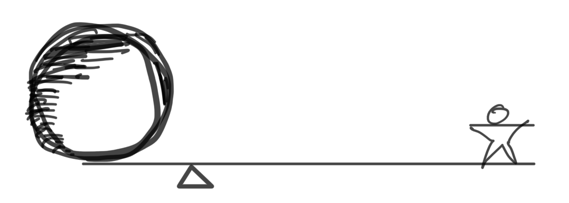

class: middle hide-slide-number

# <ins>Platform- Powered</ins>

Build a frontend platform that scales as fast as you do

#### Andrew Hao ([@andrewhao](https://www.twitter.com/andrewhao))

???

Hi everyone, I'm Andrew. I'm a software engineer at Lyft.

---

class: center middle

## Ever felt growing pains?

---

class: middle

## "...most tools and processes only support about one order of magnitude of growth before becoming ineffective"

##### Will Larson. *An Elegant Puzzle: Systems of Engineering Management*

---

## Generation 1: Monolith

- Python/Angular monolith
- Everything is in one codebase
- Conventions can be enforced
- Code is reviewed in one place

???

But problems

---

## Generation 2: React Service Template

- Node + React isomorphic (SSR) apps
- Lyft really started to embrace microservices = service explosion

---

## But the problems were starting to catch up to us

???

- Architecture drift
- Entropy
- Natural systems decay

---

class: diagram-image middle center

#### Leverage

???

This is a talk about leverage, and how to think about it and knowing where to apply it

---

class: diagram-image middle center

#### Continuum of Control

---

class: diagram-image middle center

#### Continuum of Control

---

1. Introduce *constraints*
2. That create *standardization*
3. So you can apply *automation*

---

class: diagram-image middle center

???

Where to apply constraints? Work up the stack.

---

## What would we do?

---

New concepts: Applied Control

---

In our third generation, we identified additional places in our systems where we could centralize and share code - and that was at the integration layer.

To scale a system from one generation from one generation to the next, we needed to introduce another abstraction layer.

---

Control:

Rigid interfaces. Declare that everyone needs a specific integration pattern by decree.

Flexibility:

Let things continue the way they were and try to hand-migrate everyone

---

## Generation 3 Architecture

- Next.js
- Plugin system for easy integrations with 3rd party libraries and internal tools
- Migration architecture

---

## Next.js

- Lean on OSS community to build/maintain the core infrastructure
- Filesystem router lets us ditch a lot of boilerplate code
- SSR support out of the box
- We really liked the community

---

## Plugin Architecture

A @lyft/service Plugin:

- Allows you to integration libraries by providing hooks at specific layers of the system: React (Server + Client), Express middleware, Next initialization

- Allows you to integration libraries by providing hooks at specific layers of the system: React (Server + Client), Express middleware, Next.js initialization

- Export user-functionality like hooks that are then used by the consumer.

---

## Design philosophy: Selective Control

In order to guide us into our next phase of growth, we needed to standardize and automate the parts of the ecosystem that were starting to drift

---

## Benefits we saw from our plugins

- Benefit: Consistent interfaces - standardization
- Benefit: Remove outliers
- Benefit: Flywheel effect - contributors within the community

---

## Migrations

Migrations are guardrails that prevent drift
Migrations increase user satisfaction and developer ergonomics
All plugins ship with the ability to run jscodeshift migrations, and because implementations have been standardized, can be knowingly applied
Migrations run sequentially

We also have a tool that can selectively apply and merge jscodeshifts

---

## Organizational process

- Hands-on migration workshops
- Tools that automate away 90% of the migration from Gen 2 to Gen 3
- Trainings for teams to help each other
- Relentless internal evangelism

---

## Core principles and takeaways

1. Don't overoptimize. Make sure you have a true pain point before you attempt a migration to your next phase
2. Apply selective leverage (control) at appropriate points in the system.
3. Allow escape hatches; there will always be outliers
4. Make sure you finish the job
